==================
RB-DCU i.MX 6ULL
==================

RB-DCU i.MX 6ULL Board Top View
===============================

.. raw:: latex

   \vspace{7em}

.. raw:: html

   

     
   

.. raw:: html

   

     Figure 3
   

   
.. raw:: latex

   \vspace{7em}

RB-DCU i.MX 6ULL Board Bottom View
===================================

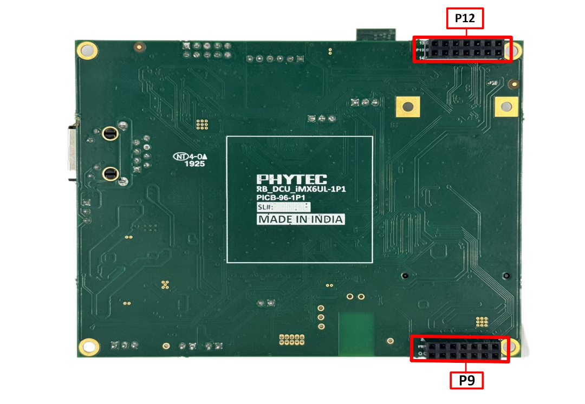

   **Figure 2**

RB-DCU i.MX 6ULL Board Block Diagram
=======================================

.. raw:: latex

   \vspace{7em}

.. raw:: html

   

     
   

.. raw:: html

   

     Figure 3
   

Power Supply Connections
========================

Power Supply Connector (P2)
----------------------------

Power management for RB-DCU i.MX 6ULL-1P1 is come up with either USB or
DC 5V.

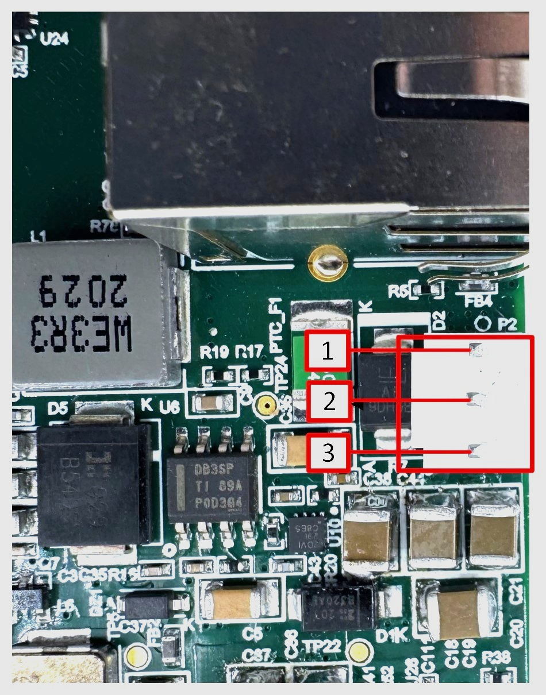

   **Figure 4: Power Supply Connector (P2)**

.. raw:: html

    

+---------------+--------------------+------------------------+
| Pin           | Signal             | Description            |
+===============+====================+========================+
| 1             | VCC5V_MAIN         | +5V power supply       |
+---------------+--------------------+------------------------+
| 2             | GND                | GND                    |
+---------------+--------------------+------------------------+
| 3             | SHILD              | Shield                 |
+---------------+--------------------+------------------------+

.. raw:: html

   

     Table 4: Pin Assignment of P2
   

.. raw:: html

    

.. note::
   By default, the board uses the 5 V DC adapter as its primary power source.

Power Supply LED (D3)
---------------------
The LED D3 indicates the presence of the 3.3 V supply voltage generated from
the 5V input voltage.

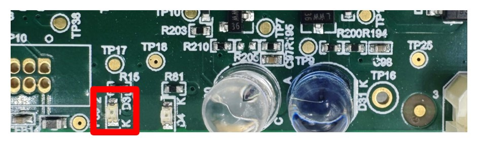

   **Figure 5: Power Supply LED (D3)**

.. tip::
   After applying power, D3 should light up almost immediately—if it doesn’t, check that your 5 V adapter is delivering the correct voltage and that the barrel jack is firmly seated.

TTL Debug Port (J1)
======================
This port usually provides a **serial communication interface** that follows the
**UART1 (Universal Asynchronous Receiver-Transmitter)** protocol with TTL
voltage levels.

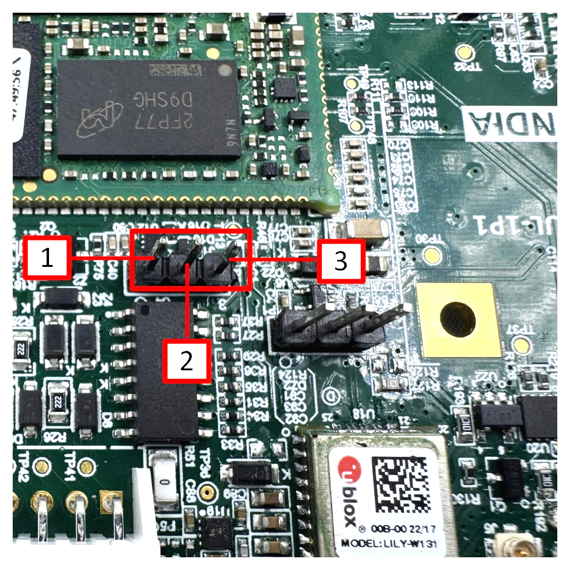

   **Figure 6: TTL Debug Port (J1)**

.. raw:: html

    

+---------------+--------------------+
| Pin           | Signal             |
+===============+====================+
| 1             | X_UART1_TX_DCE     |
+---------------+--------------------+
| 2             | X_UART1_RX_DCE     |       
+---------------+--------------------+
| 3             | GND                |
+---------------+--------------------+

.. raw:: html

   

     Table 6: Pin Assignment of J1
   

.. raw:: html

    
.. note::
   The TTL debug port (J1) uses 3.3 V logic levels (TX, RX, GND). Do **not** connect it directly to RS-232 interfaces—use a USB-to-TTL serial adapter or level shifter to prevent damage.

Boot Mode Configuration Selection (J9)
======================================

The RB-DCU i.MX 6ULL-1P1 has two defined boot sequences which can be
selected by configuring jumper J9.

.. warning::
   If J9 is left open (eMMC boot) and no valid image is present on the on-board flash, the board will hang during startup. Always confirm your boot media contains a valid bootloader.

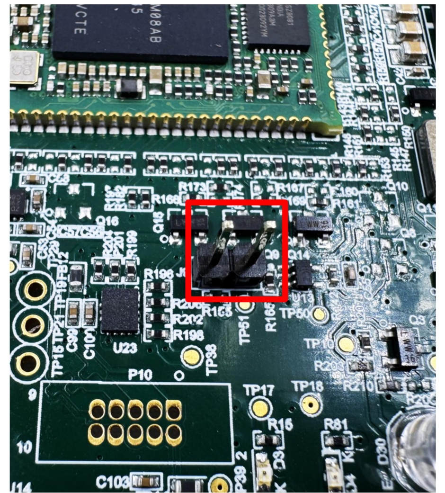

   **Figure 7: Boot Mode Selection Jumper (J9)**

.. raw:: html

    

+-----------------------------+------------------+
| Boot mode                   | Description      |
+=============================+==================+
| Boot mode 1(with jumper)    | MMC boot         |
+-----------------------------+------------------+
| Boot mode 2(without jumper) | EMMC boot        |
+-----------------------------+------------------+

.. raw:: html

   

     Table 7: Pin Assignment of J9
   

.. raw:: html

    
.. note::
   Jumper J9 selects between SD-card (MMC) boot and on-board eMMC boot. Ensure the board is **powered off** before changing the jumper position to avoid unintended writes or boot failures.

System Reset Button (SW2)
============================

The RB-DCU i.MX 6ULL-1P1 is equipped with a system reset button at SW2.
Pressing this button will toggle the **X_nRESET_IN**,causing the module to
reset.Additionally,the reset signal **X_nRESET_OUT(X_RESET#)** is generated on
the module to also reset the peripherals on the carrier board.

.. warning::
   Pressing SW2 abruptly restarts the CPU and peripherals without a clean shutdown—unsaved data in volatile memory or on attached storage may be lost. Use it sparingly and only when necessary.
.. raw:: html

    
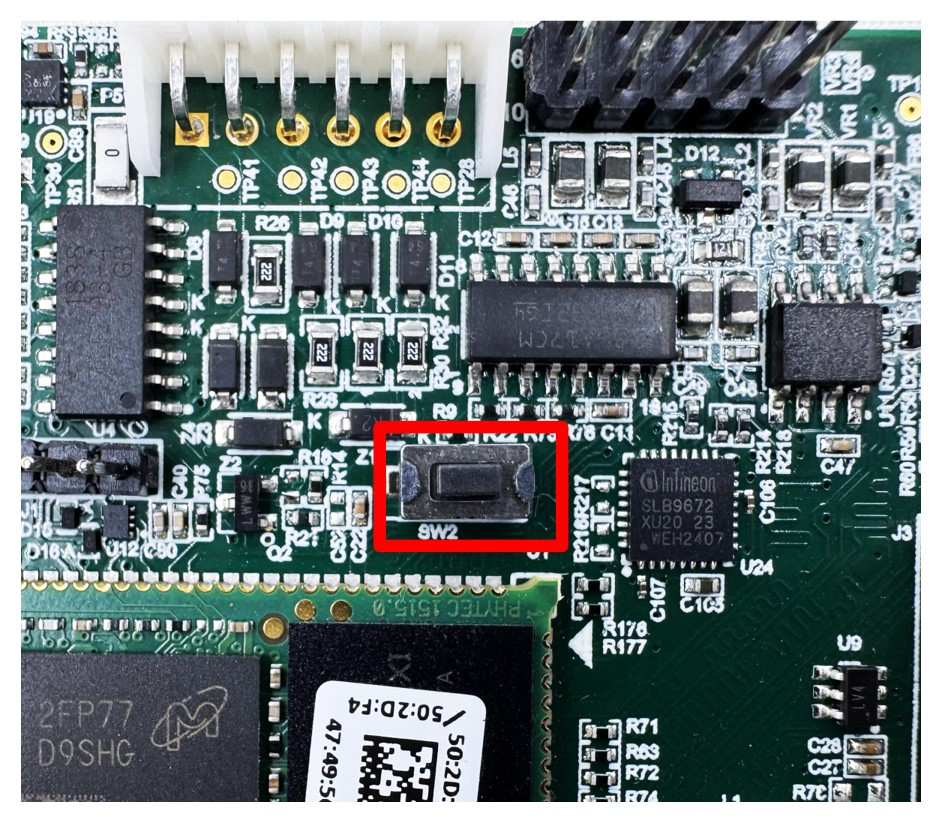

   **Figure 8: System Reset Button (SW2)**

.. raw:: html

    

.. csv-table::
   :header: "Pin", "Description"
   :widths: 20, 80

   "X_nRESET_IN", "Active-low input reset signal to the processor module, triggered by SW2."
   "X_nRESET_OUT (X_RESET#)", "Active-low output reset signal from the module to reset peripherals on the carrier board."

.. raw:: html

   

     Table 8: Pin Assignment of SW2
   

Li-ion Battery Charger (P7)
============================

External Li-ion battery (3.7V) is used to boot the board.

.. warning::
   Li-ion batteries can be hazardous if over-discharged or short-circuited. Always use a proper Li-ion charging circuit and respect the battery’s current and temperature limits to avoid fire or damage.

.. raw:: html

    

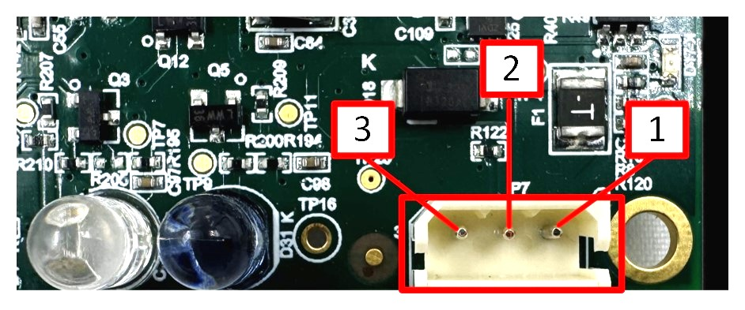

   **Figure 9: Li-ion Battery Charger (P7)**

.. raw:: html

    

.. note::
   Connector P7 lets you attach a 3.7 V Li-ion battery for backup or standalone operation—ensure the battery voltage does not exceed 4.2 V when fully charged.

.. raw:: html

    

+---------------+--------------------+
| Pin           | Signal             |
+===============+====================+
| 1             | VBAT_OUT(BAT_TS)   |
+---------------+--------------------+
| 2             | BAT_TS             |
+---------------+--------------------+
| 3             | GND                |
+---------------+--------------------+

.. raw:: html

   

     Table 9: Pin Assignment of P7
   

.. raw:: html

    

.. tip::
   To monitor battery health, measure the voltage on the **BAT_TS** pin (Pin-2). You can read this via an ADC channel on the SOM to implement low-battery shutdown or alert notifications in your application.
   

RTC (P11)
=========

The RB-DCU i.MX 6ULL-1P1 features an external RTC at P11 in addition to the
internal RTC.They are used for real-time or time-driven applications. The 2-pole
pin header P11 can be used to connect an external battery to keep time up to
date. Internal RTC is not mounted in board.

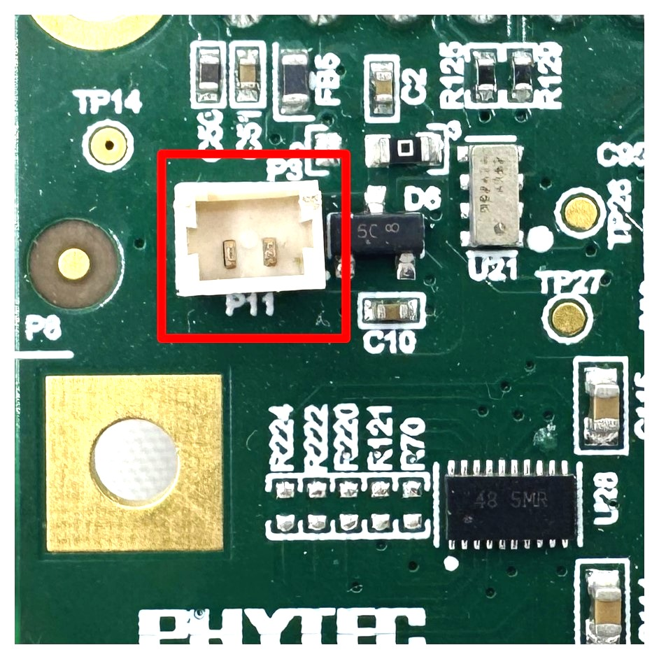

   **Figure 10: RTC (P11)**

.. raw:: html

    

+---------------+--------------------+------------------------+
| Pin           | Signal             | Description            |
+===============+====================+========================+
| 1             | GND                | Ground                 |
+---------------+--------------------+------------------------+
| 2             | VCC_3V3            | Backup battery voltage |
+---------------+--------------------+------------------------+

.. raw:: html

   

     Table 10.1: Pin Assignment of P11
   

.. raw:: html

     

+---------------+--------------------+------------------------+
| Pin           | Signal             | Description            |
+===============+====================+========================+
| 1             | INT_RTC            | Internel RTC           |
+---------------+--------------------+------------------------+
| 2             | RTC_BACKUP         | RTC backup             |
+---------------+--------------------+------------------------+
| 3             | EXT_RTC            | External RTC           |
+---------------+--------------------+------------------------+

.. raw:: html

   

     Table 10.2: Pin Assignment of P3
   

User LED (D4)
=================

The RB-DCU i.MX 6ULL-1P1 is populated with one user LEDs to indicate the
status of the user led, as well as the power supply voltage. View of the
RB-DCU i.MX 6ULL-1P1 (top) shows the location of the LED.

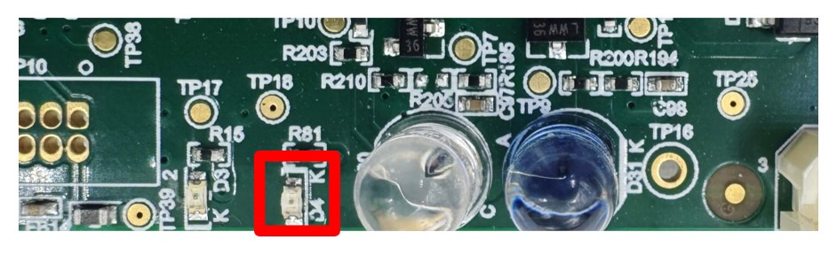

   **Figure 11: (D4)**

.. raw:: html

     

+---------+-------------+---------------+-------------------------------+
| LED     | Colour      | Description   | Section                       |
+=========+=============+===============+===============================+
| D4      | Green       | User LED1     | User GPIO Config_RGB LED(D4)  |
+---------+-------------+---------------+-------------------------------+

.. raw:: html

   

     Table 11: Pin Assignment of D4
   

User Switch (SW1)
=====================

The RB-DCU i.MX 6ULL-1P1 is populated with Single user Switch to check the
INPUT operation of the board.**X_GPIO2_IO8_INT_SW** is used for switch.

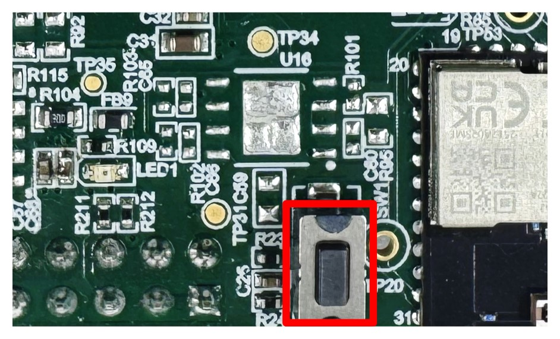

   **Figure 12: Switch1 (SW1)**

.. csv-table:: 
   :header: "Pin", "Description"
   :widths: 20, 80

   "X_GPIO2_IO8_INT_SW", "GPIO signal connected to SW1. Used to detect switch press in the software layer."

.. raw:: html

   

     Table 12: Pin Assignment of SW1
   

Mini PCIe (P8)
==================

**USB-OTG interface** signals are routed through the **Mini PCIe connector (P8)**,
which allows devices connected via mPCIe to communicate using the USB
protocol. The SIM/UIM card signals of a connected mPCIe module can be made
available at expansion connector J4.

.. warning::
   Many mPCIe cards expect a full 5 V supply on the slot’s VCC pin—do **not** insert a USB-only module without confirming the board’s power capabilities, as overcurrent can cause brown-outs or damage the board.
   
.. raw:: html

    

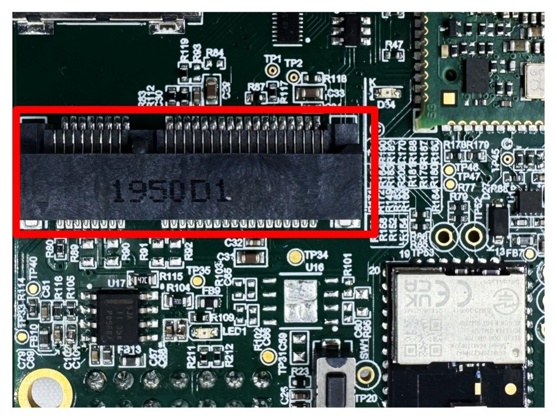

   **Figure 13: Mini PCIe Connector (P8)**

.. raw:: html

    

.. csv-table::
   :header: "Pin", "Signal", "Pin", "Signal"
   :widths: 8,30,8,30

   1, VCC_3V3_GSM, 29, GND
   2, VCC_3V3_GSM, 30, Not used
   3, Not used,     31, GND
   4, GND,          32, Not used
   5, Not used,     33, Not used
   6, Not used,     34, GND
   7, eSIM_RST,     35, GND
   8, SIM_VCC,      36, X_USB_OTG_N
   9, GND,          37, GND
   10, SIM_IO,      38, X_USB_OTG_P
   11, Not used,    39, VCC_3V3_GSM
   12, SIM_CLK,     40, GND
   13, SIM_eSIM_VDD,41, VCC_3V3_GSM
   14, SIM_RST,     42, WLAN_EN_LED
   15, GND,         43, GND
   16, SIM_VPP,     44, Not used
   17, eSIM_CLK,    45, Not used
   18, GND,         46, Not used
   19, eSIM_DATA,   47, Not used
   20, VCC_3V3_GSM, 48, Not used
   21, GND,         49, Not used
   22, X_RESET#,    50, GND
   23, Not used,    51, Not used
   24, VCC_3V3_GSM, 52, VCC_3V3_GSM
   25, Not used,    S1, GND
   26, GND,         S2, GND
   27, GND,         M1, Not used
   28, Not used,    M2, Not used

.. raw:: html

   

     Table 13: Pin Assignment of P8
   

   
Micro SIM Socket (J4)
=========================

A Micro SIM Socket(J4) is provided to enable cellular connectivity through a
mobile network and a smooth extraction function by Push-in/ Push-out of
card.

.. warning::

   Do **not** insert or remove the SIM card while the board is powered on. Doing so may cause hardware damage or corrupt modem communication.

.. raw:: html

    

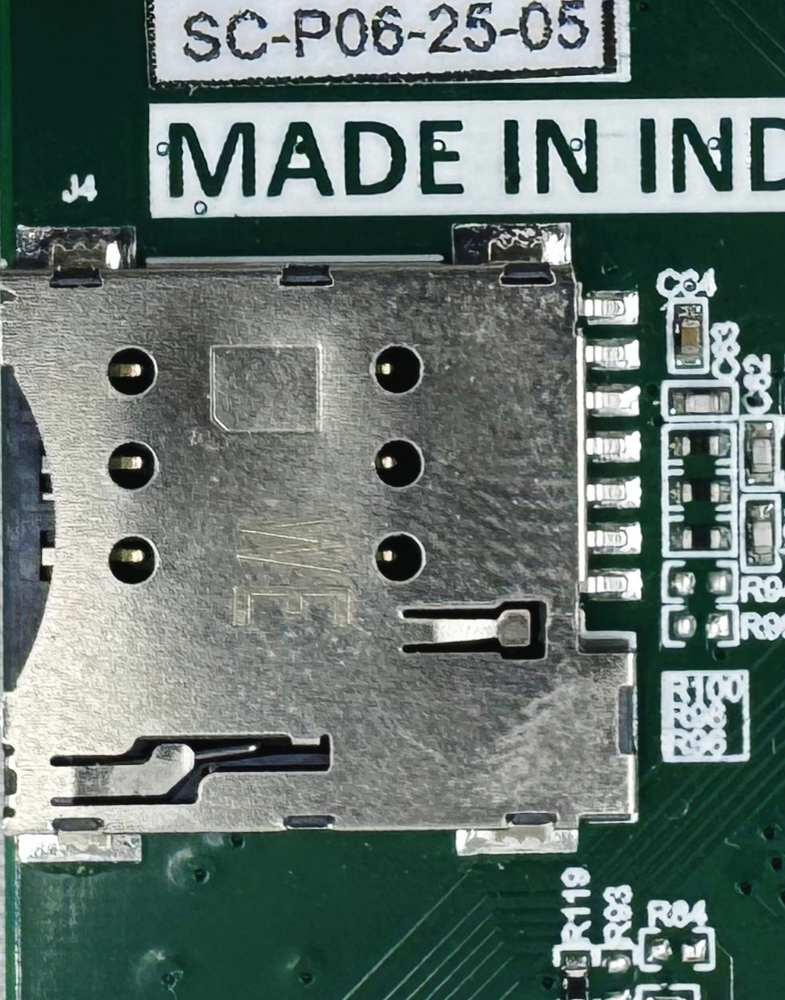

   **Figure 14: Micro SIM Socket (J4)**

.. csv-table:: 
   :header: "Left Pin", "Signal", "Right Pin", "Signal"
   :widths: 8, 25, 8, 25

   C1, SIM_VCC,      C7, TP32
   C2, SIM_RST,      S1, GND
   C3, SIM_CLK,      S2, GND
   C4, Not used,     S3, GND
   C5, GND,          S4, GND
   C6, SIM_VPP,      CD, SIM_VCC

.. raw:: html

   

     Table 14: Pin Assignment of J4
   

.. raw:: html

    

.. note::

   This socket is designed for **Micro SIM** cards only. Using a Nano or full-size SIM with adapters may damage the socket.
   

eSIM (U16)
=============

eSIM offers significant advantages over traditional SIMs, particularly in terms
of flexibility, scalability, and ease of management, especially for IoT and
embedded systems that rely on cellular connectivity.eSIM is not mounted.

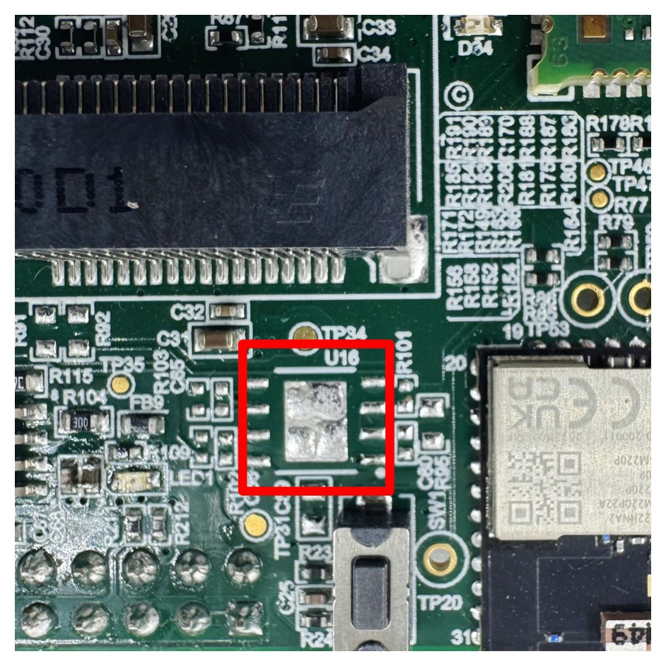

   **Figure 15: eSIM (U16)**

.. note::

   eSIM (Embedded SIM) is a programmable SIM card embedded directly into the device, eliminating the need for a physical SIM card slot. It allows remote provisioning and management of mobile network profiles.

.. raw:: html

    

.. tip::

   eSIM is ideal for **remote or hard-to-access deployments**, where replacing a physical SIM card would be difficult.

.. raw:: html

    

.. csv-table::
   :header: "Pin", "Signal", "Pin", "Signal"
   :widths: 5, 25, 5, 25

   1, GND,            6, eSIM_CLK
   2, SIM_eSIM_VDD,   7, eSIM_RST
   3, eSIM_DATA,      8, SIM_eSIM_VDD
   4, Not used,       9, Not used
   5, Not used,       ,

.. raw:: html

   

     Table 15: Pin Assignment of U16
   

.. raw:: html

    

.. note::

   The eSIM (U16) module is **not pre-mounted** on the board. If eSIM functionality is required, you must mount a compatible eSIM module manually.

   
Wi-Fi Module (U18)
======================

The LILY-W1 series ultra-compact Wi-Fi front end modules include an
integrated MAC/baseband processor and RF front end components. The
modules connect to a host via USB interface. They provide simultaneous
operation as a station and a micro access point for up to 8 clients.

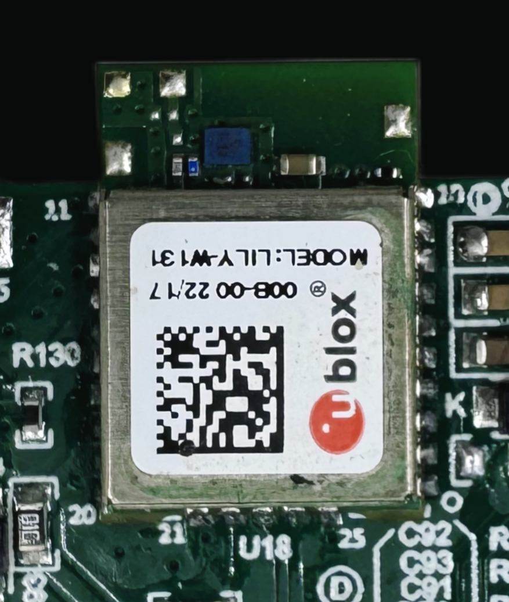

   **Figure 16: Wi-Fi Module (U18)**

.. csv-table:: 
   :header: Pin, Signal, Pin, Signal
   :widths: 6,40,6,40

   1, Not used,              20, Not used
   2, Not used,              21, GND
   3, Not used,              22, VCC_1V8
   4, VCC_3V3_WIFI_MOD,      23, X_USB_OTG2_D_P
   5, Not used,              24, X_USB_OTG2_D_N
   6, GND,                   25, GND
   7, Not used,              26, GND
   8, TP36,                  27, GND
   9, TP36,                  28, GND
   10, GND,                  29, GND
   11, GND,                  30, GND
   12, UFL Coax (J5),        31, GND
   13, GND,                  32, GND
   14, WIFI_PDn,             33, GND
   15, Not used,             34, GND
   16, Not used,             35, GND
   17, WAKE_UP_1V8_IO,       36, GND
   18, Not used,             37, GND
   19, X_HOST_WAKE_UP_3V3IO, ,

.. raw:: html

   

     Table 16: Pin Assignment of U18
   

   
   
Ethernet Connectivity (J3)
===========================

The Ethernet interfaces of the RB-DCU i.MX 6ULL-1P1 are accessible at RJ45
connector(J3). Ethernet is directly brought out from the SOM's Ethernet
interface ENET1.Ethernet interface is configured as 10/100Base-T networks.
The LEDs for LINK (green) and SPEED (yellow) indications are integrated into
the connector.

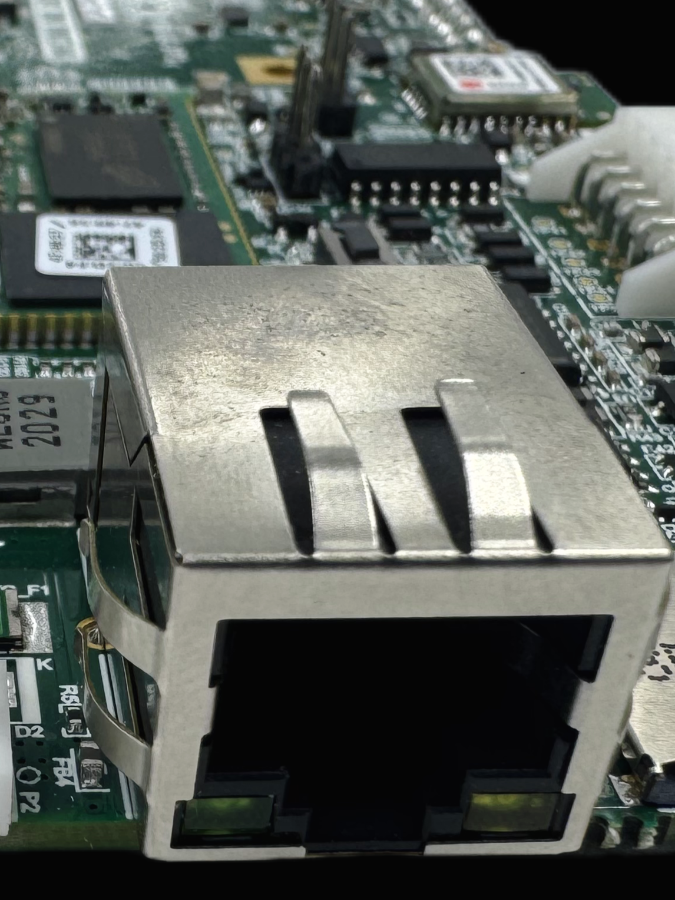

   **Figure 17: Ethernet Interfaces at Connector (J3)**

.. note::

   The **Ethernet port (J3)** uses the **ENET1 interface** from the SOM and supports **10/100 Mbps** operation. Link and activity status are indicated through integrated **bi-color LEDs** (green for LINK, yellow for SPEED).

DB9 Pin Mating (P4)
=======================

The RB-DCU i.MX 6ULL-1P1 provides up to 4 high-speed universal asynchronous
interfaces. UART2 at RS232(U3) and UART6 at RS485(U11) is available at DB9
pin mating Male connector(P4).

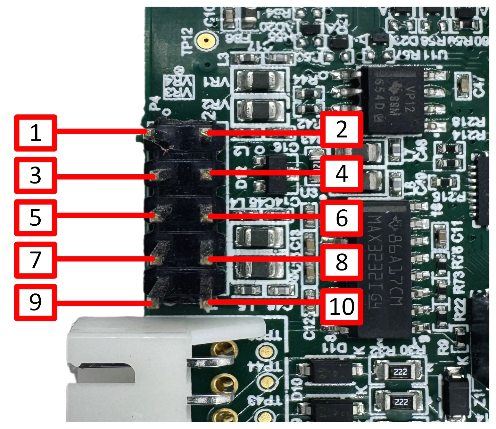

   **Figure 18: RS-232 and RS‑485 Interface Connectors at (P4)**

.. raw:: html

    

.. csv-table:: 
   :header: "Pin", "Signal", "Pin", "Signal"
   :widths: 5, 25, 5, 25

   1, GND, 2, DB_RS232_RX_1
   3, DB_RS232_TX_1, 4, DB_RS485_N
   5, GND, 6, DB_RS485_P
   7, DB_RS232_RX_2, 8, DB_RS232_TX_2
   9, GND, 10, GND

.. raw:: html

   

     Table 18: Pin Assignment of P4
   

.. raw:: html

    

.. note::

   On the RB-DCU i.MX 6ULL-1P1 board:

   - **RS232 communication uses UART2**
   - **RS485 communication uses UART6**

   
RF-Connector 1 (P9)
=======================

RF (Radio Frequency) connectors are used for interfacing with wireless
communication modules and antennas. These connectors allow to send and
receive RF signals, which can be essential for applications involving Wi-Fi,
Bluetooth, GPS, cellular networks, and other wireless communication
technologies.RF connector1 is using **UART4 interface**.

.. warning::

   Do not hot-plug RF modules into the connector while the board is powered on, 
   as this may cause signal disruption or hardware damage.
.. raw:: html

    

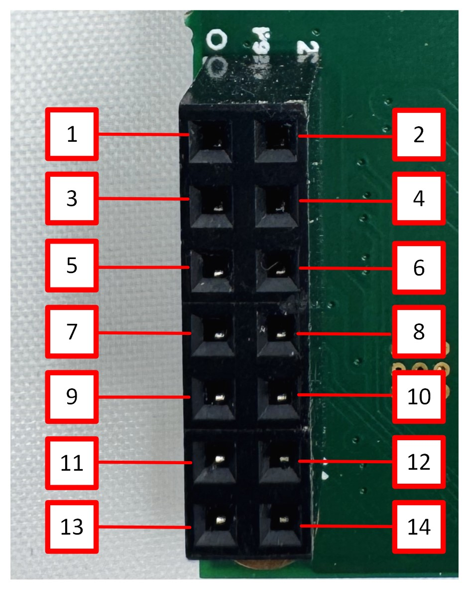

   **Figure 19: RF-Connector-1 (P9)**

.. raw:: html

    

.. csv-table::
   :header: "Pin", "Signal", "Pin", "Signal"
   :widths: 5, 25, 5, 25

   1, VCC_3V3, 2, GND
   3, VCC_3V3, 4, GND
   5, X_UART4_TX, 6, GND
   7, X_UART4_RX, 8, GND
   9, X_GPIO2_IO9_RF1_RST , 10, GND
   11, X_GPIO5_IO9_RF1_1, 12, GND
   13, X_GPIO2_IO14_RF1_2, 14, GND

.. raw:: html

   

     Table 19: Pin Assignment of P9
   

.. raw:: html

    

.. note::

   RF_CONNECTOR 1 is typically connected to external antennas or RF modules 
   that support UART communication. Confirm the module's specifications 
   before connection.

   
RF-Connector 2 (P12)
========================

RF (Radio Frequency) connectors are used for interfacing with wireless
communication modules and antennas. These connectors allow to send and
receive RF signals, which can be essential for applications involving Wi-Fi,
Bluetooth, GPS, cellular networks, and other wireless communication
technologies.RF connector1 is using **UART3 interface**.

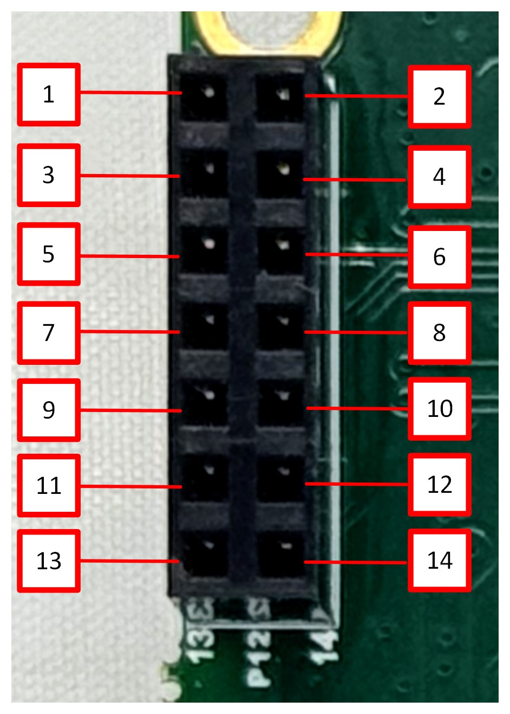

   **Figure 20: RF-Connector-2 (P12)**

.. raw:: html

    

.. csv-table::
   :header: "Pin", "Signal", "Pin", "Signal"
   :widths: 5, 25, 5, 25

   1, VCC_3V, 2, GND
   3, VCC_3V, 4, GND
   5, X_UART3_TX, 6, GND
   7, X_UART3_RX, 8, GND
   9, X_GPIO1_IO10_RF2_RST , 10, GND
   11, X_GPIO2_IO15_RF2_1, 12, GND
   13, X_GPIO1_IO14_RF2_2, 14, GND

.. raw:: html

   

     Table 20: Pin Assignment of P12
   

Optical UART (D30 & D31)
========================

An "Optical UART" typically refers to a communication interface that combines
the principles of UART (Universal Asynchronous Receiver/Transmitter) with
optical signalling for data transmission. In this system, instead of electrical
signals transmitted over copper wires, light pulses are used, often through
optical fibbers or LEDs and photodiodes. The benefits of optical
communication include immunity to electromagnetic interference (EMI) and
enhanced isolation for sensitive systems. It is using UART7 interface and for
transmit and receive data pins are:

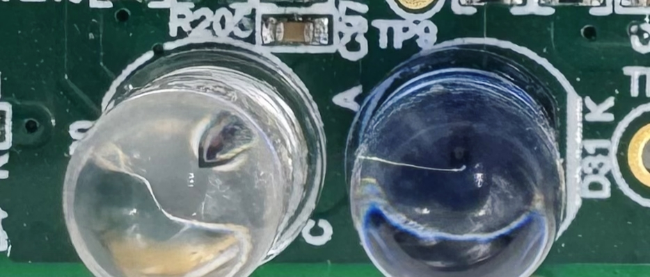

   **Figure 21: Optical UART (D30 & D31)**

.. raw:: html

    

+-------+------------------------+------------------------+
| Pin   | Signal                 | Description            |
+=======+========================+========================+
|  1    | X_LCD_D16_UART7_TX     | UART7 Transmit Line    |
+-------+------------------------+------------------------+
|  2    | X_LCD_D17_UART7_RX     | UART7 Receive Line     |
+-------+------------------------+------------------------+

.. raw:: html

   

     Table 21: Pin Assignment of D30 & D31
   

.. raw:: html

    
.. note::

   Optical UART offers galvanic isolation, making it ideal for use in electrically noisy or high-voltage environments.

SPI-LCD Header (P10)
========================

A **SPI-LCD header** allows to connect an LCD (Liquid Crystal Display) using the
**Serial Peripheral Interface (SPI)** communication protocol. SPI is a common
interface used to communicate with peripherals like displays, sensors, and other
devices.

.. warning::

   Incorrect wiring of SPI pins (MOSI, MISO, CLK, CS) may result in non-functional display or permanent damage to the LCD module.

.. raw:: html

    

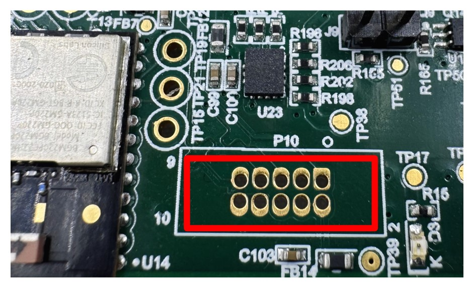

   **Figure 22: SPI-LCD Header (P10)**

.. raw:: html

    

.. csv-table::
   :header: "Pin", "Signal", "Pin", "Signal"
   :widths: 5, 20, 5, 20

   1, X_ECSPI1_SS0,     6, X_GPIO_DC
   2, VCC5V_IN_SW,      7, X_ECSPI1_SCLK
   3, X_RESET#,         8, GND
   4, VCC5V_IN_SW,      9, X_ECSPI1_MISO
   5, X_ECSPI1_MOSI,   10, GND

.. raw:: html

   

     Table 22: Pin Assignment of P10
   

.. raw:: html

    

.. note::

   The SPI-LCD header provides a compact and efficient connection method for graphic or character-based LCDs compatible with SPI.

Tamper Pins (TP48, TP49)
============================

**Tamper pins** are security-oriented hardware features designed to detect
unauthorized physical access or tampering with the device.They are used to
monitor the integrity of the device and respond to any physical breaches or
tampering attempts and **X_GPIO5_1, X_GPIO5_2** pins are used.

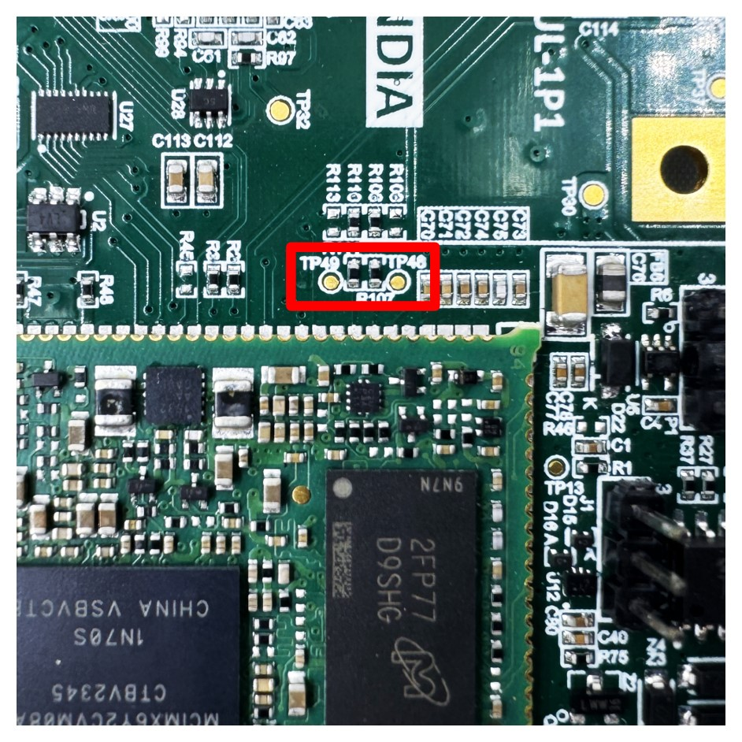

   **Figure 23: Tamper Pins**

.. raw:: html

    

.. note::

   Tamper detection is especially useful in security-critical applications such as financial terminals, industrial control systems, and IoT gateways.

.. raw:: html

    

.. csv-table::
   :header: "Pin", "Description"
   :widths: 20, 80

   "X_GPIO5_1", "GPIO used for tamper detection, triggered by TP48."
   "X_GPIO5_2", "GPIO used for tamper detection, triggered by TP49."

.. raw:: html

   

     Table 23: Pin Assignment of TP48 & TP49
   

.. raw:: html

    

.. tip::

   Configure tamper pins in software to trigger alerts, log events, or disable sensitive operations upon detection of tampering.

   
Digital Input HDR (P5)
==========================

A **digital input header** is a physical interface (set of pins) that allows to receive
**digital signals** from external devices or sensors. These pins are used to detect
binary states, which are usually either **high (1)** or **low (0)**, representing the
presence or absence of a voltage signal.
Note: Default State of Digital Input (Low) and Defined as Input Port When
Isolated Voltage connected upto 24V from external; MCU reads High (3.3V).

.. warning::

   Exceeding the 24V input limit may permanently damage the digital input circuitry. Always verify the voltage levels before connection.

.. raw:: html

    

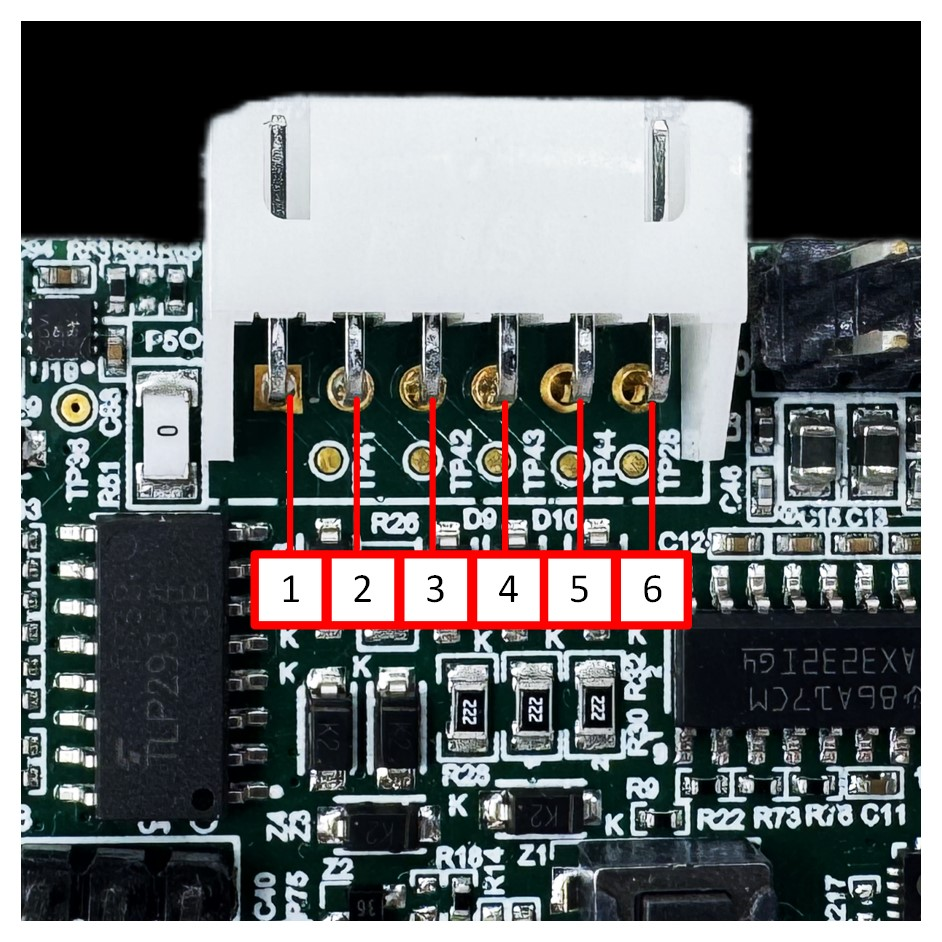

   **Figure 24: Digital Input HDR (P5)**

.. raw:: html

    

+--------+-------------------------------------------------------------+
| Pin    | Signal                                                      |
+========+=============================================================+
| 1      | DIN(0–24V)_01 (VCC_3V3)                                     |
+--------+-------------------------------------------------------------+
| 2      | DIN(0–24V)_02 (VCC_3V3)                                     |
+--------+-------------------------------------------------------------+
| 3      | DIN(0–24V)_03 (VCC_3V3)                                     |
+--------+-------------------------------------------------------------+
| 4      | DIN(0–24V)_04 (VCC_3V3)                                     |
+--------+-------------------------------------------------------------+
| 5, 6   | DGND_ISO_IN (X_GPIO5_5, X_GPIO2_IO13, X_GPIO1_01)           |
+--------+-------------------------------------------------------------+

.. raw:: html

   

     Table 24: Pin Assignment of P5
   

Micro SD Card (J2)
======================

The RB-DCU i.MX 6ULL-1P1 provides a standard micro SDHC card slot at **J2** for
connection to MMC/SD interface cards. It allows easy and convenient
connection to peripheral devices such as SD and MMC cards. Power to the SD
interface is supplied by inserting the appropriate card into the MMC/SD
connector, which features card detection, a lock mechanism, and a smooth
extraction function via Push-in/Push-out of the card.

Insertable jumper **J9** allows toggling between eMMC boot and boot from the
SD card. To boot from the SD card, **J9** must be set to change the boot
configuration (Boot Mode Jumper J9).

.. warning::

   Do not insert or remove the SD card while the system is powered on, as it may corrupt data or damage the card.

.. raw:: html

    

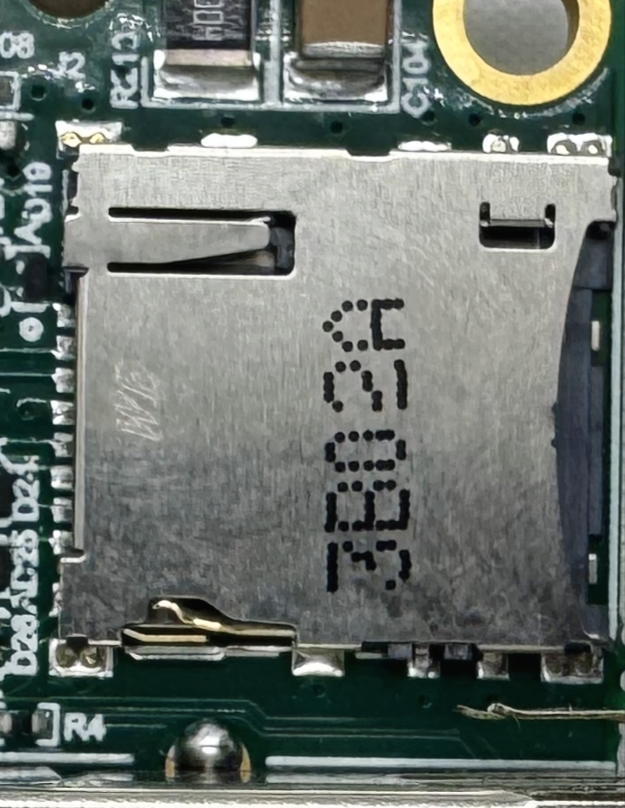

   **Figure 25: Micro SD Card Interface at Connector (J2)**

.. note::

   The microSD card interface supports SDHC cards up to 32 GB. Use cards that are formatted as FAT32 for best compatibility.

.. csv-table:: 
   :header: "Pin", "Signal", "Pin", "Signal"
   :widths: 5, 25, 5, 25

   1,  X_SD1_D2,                 10, GND
   2,  X_SD1_D3,                 11, GND
   3,  X_SD1_CMD,                12, GND
   4,  VCC_3V3,                  13, GND
   5,  X_SD1_CLK,                14, GND
   6,  GND,                      15, GND
   7,  X_SD1_D0,                 16, GND
   8,  X_SD1_D1,                 17, GND
   9,  X_UART1_RTS_B_SD_CD,      18, GND

.. raw:: html

   

     Table 25: Pin Assignment of J2
   

.. raw:: html

    

.. tip::

   To boot from the SD card, make sure the J9 jumper is configured for SD boot **before powering on** the board.

Bluetooth (U14)
================

Bluetooth functionality enables wireless communication with other Bluetooth
devices, such as smartphones, computers, sensors, and other peripherals.It
uses **UART5 interface**.

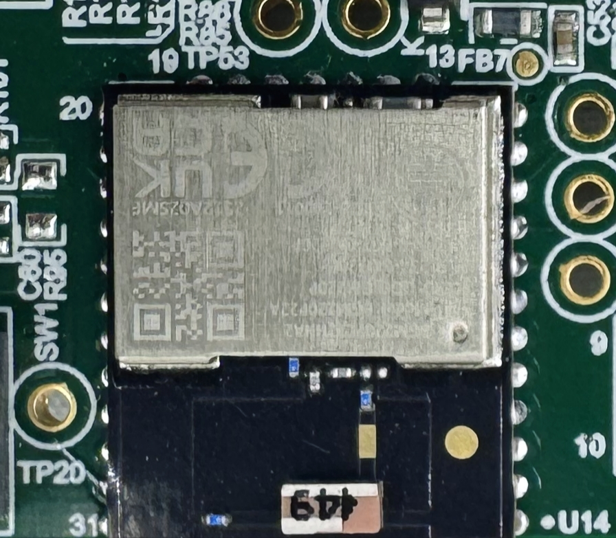

   **Figure 26: Bluetooth (U14)**

.. raw:: html

    
   

.. csv-table:: 
   :header: "Pin", "Signal", "Pin", "Signal"
   :widths: 5, 25, 5, 25

   1,  GND,                         17, X_UART5_RTS_B
   2,  Not used,                   18, Not used
   3,  Not used,                   19, Not used
   4,  Not used,                   20, GND
   5,  Not used,                   21, Not used
   6,  Not used,                   22, X_LCD_VSYNC_WATCH_DOG
   7,  Not used,                   23, Not used
   8,  SWCLK,                      24, Not used
   9,  SWDIO,                      25, Not used
   10, SWO,                        26, Not used
   11, Not used,                   27, Not used
   12, GND,                        28, Not used
   13, VCC_3V3_BLE,                29, Not used
   14, X_UART5_RX (TP52),          30, X_GPIO_BLE_RST
   15, X_UART5_TX (TP53),          31, GND
   16, X_UART5_CTS_B,              ,

.. raw:: html

   

     Table 26: Pin Assignment of U14
   

.. raw:: html

    

.. tip::

   Ideal for short-range, low-power wireless communication in embedded IoT
   systems. Can be used for serial console, wireless sensor data, or configuration
   without cables.

   
Accelerometer, Gyroscope - 3 Axis (Embedded Temperature Sensor) (U23)  
======================================================================

An **Accelerometer** and a **Gyroscope** with an embedded temperature sensor,
typically in a 3-axis configuration, are common sensors used for motion
sensing, orientation tracking, and environmental monitoring. It is using **I2C1
interface**.

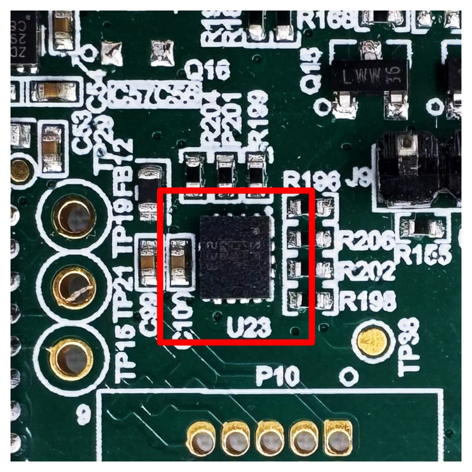

   **Figure 27: Accelerometer, Gyroscope - 3 Axis (Embedded Temperature sensor) (U23)**

.. note::

   This sensor module communicates via the I2C1 bus. Ensure proper pull-up
   resistors on SDA and SCL lines if not already present on the board.

.. raw:: html

    

.. csv-table:: 
   :header: "Pin", "Signal", "Pin", "Signal"
   :widths: 5, 30, 5, 30

   1,  VCC_3V3_SEN,           8,  VCC_3V3
   2,  VCC_3V3,               9,  Not used
   3,  VCC_3V3,              10,  Not used
   4,  X_CSI_FIELD_GPIO_3V3, 11,  Not used
   5,  VCC_3V3,              12,  VCC_3V3_SEN
   6,  GND,                  13,  X_I2C1_SCL (TP47)
   7,  GND,                  14,  X_I2C1_SDA (TP46)

.. raw:: html

   

     Table 27: Pin Assignment of U23
   

.. raw:: html

    

.. tip::

   The combined use of accelerometer and gyroscope enables precise motion
   tracking, ideal for gesture detection, tilt sensing, and inertial navigation in
   embedded applications.

.. raw:: html

   

=====================
SD Card Setup Guide
=====================

SD Card Partition Setup
=======================

**Step 1:** Insert the SD card into your PC. Then open the application named **GParted Partition Editor**. It will prompt you for a password. After entering the password, GParted will open.

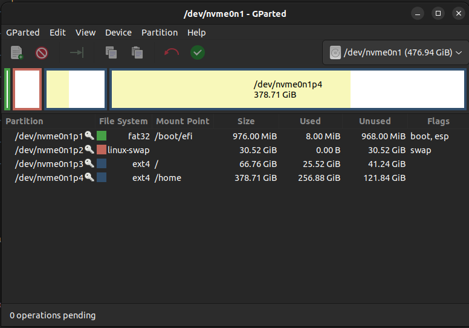

   **Figure 28: GParted application opened successfully**

.. raw:: html

    

.. warning::
   Be careful when using GParted — your PC's SSD/HDD and the SD card partitions are all shown. Mistakes can lead to data loss!

---

**Step 2:** Select your SD card device in the dropdown at the top-right corner.

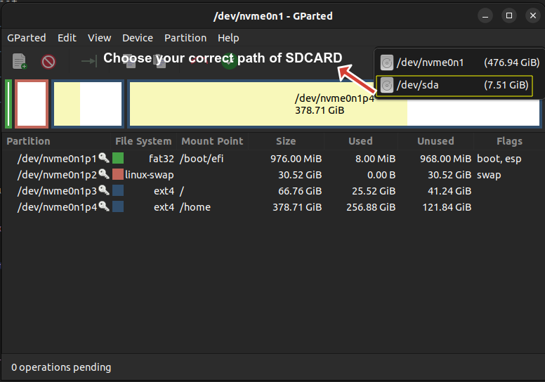

   **Figure 29: Selecting the SD card device from GParted's device list**

.. raw:: html

    

**Step 3:** Unmount all partitions on the SD card using right-click, then delete all partitions.

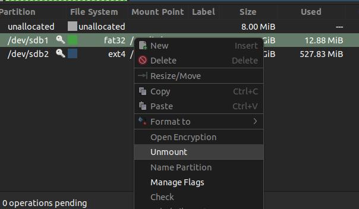

   **Figure 30: Unmounting all partitions on the SD card**

.. raw:: html

    

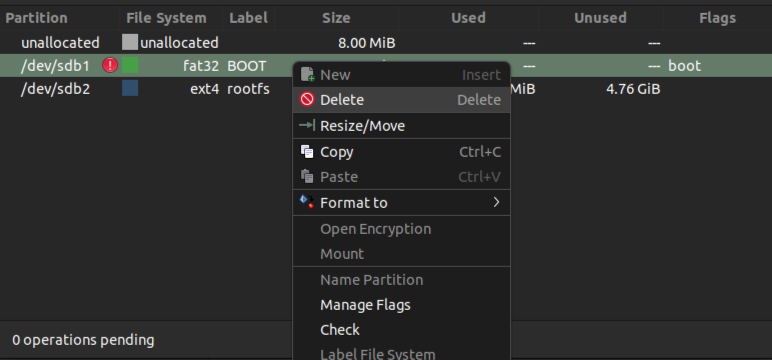

   **Figure 31: Deleting all partitions from the SD card**

.. raw:: html

    

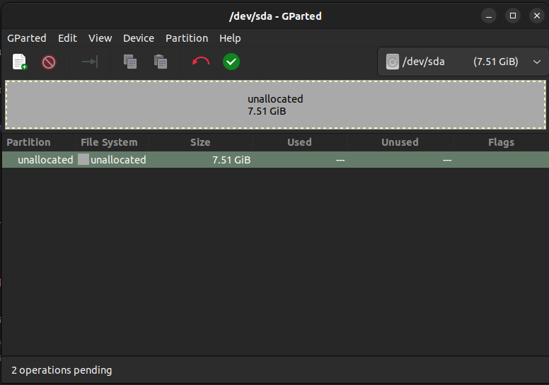

   **Figure 32: Final view showing SD card with all partitions deleted**

.. raw:: html

    

   
**Step 4:** Right-click on the unallocated partition and select the **New** option. A window titled *Create New Partition* will appear.

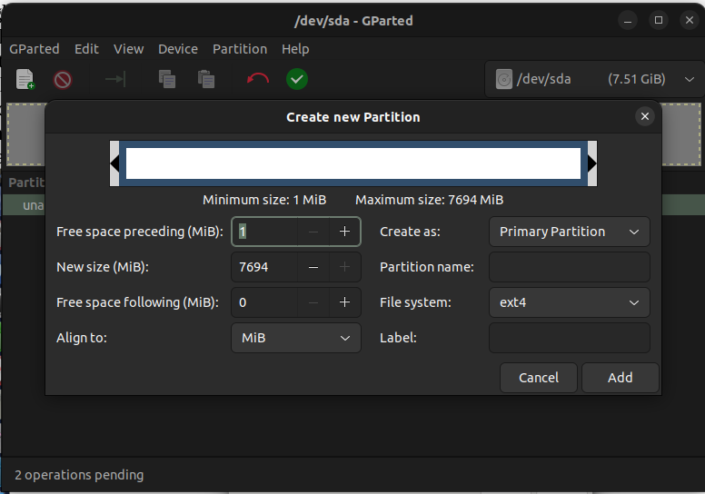

   **Figure 33:Creating a new partition in GParted**

.. raw:: html

    

**Step 5:** For the **boot** partition:
- Set “Free space preceding” to **8**
- Set “New size” to **2048**
- Select **fat32** as the file system
- Set label as **boot**
- Click **Add**

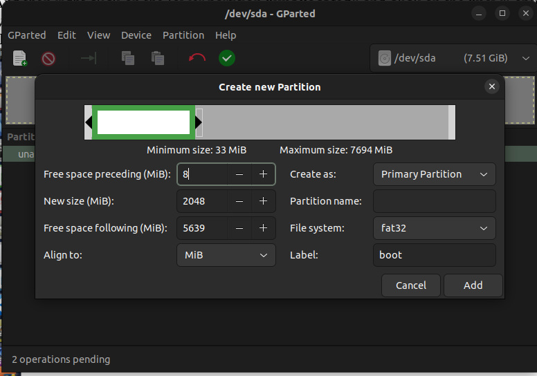

   **Figure 34:Configuring parameters for the boot partition**

.. raw:: html

    

**Step 6:** To create the **rootfs** partition:
- Right-click the remaining **unallocated** space
- Choose **New**
- Set “New size” to **1024** or use the remaining space
- Select **ext3** as the file system
- Label it as **rootfs**
- Click **Add**

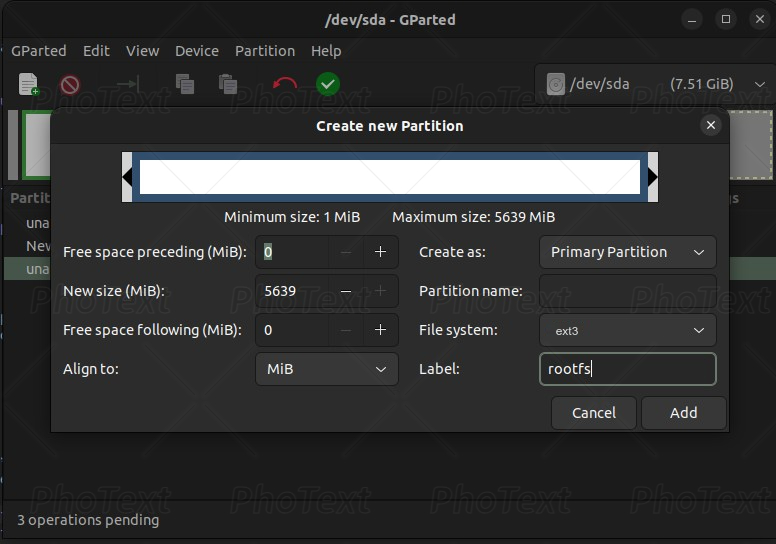

   **Figure 35:Setting up the rootfs partition**

.. raw:: html

    

**Step 7:** Click the **✔️ Apply** button on the toolbar. It will apply all pending operations and may take a few seconds. Close the window after completion.

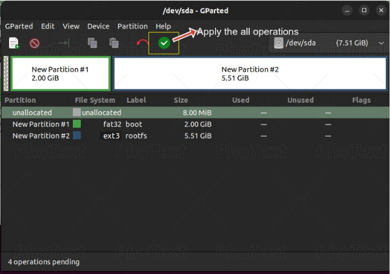

   **Figure 36:Applying all pending partition changes**

.. raw:: html

    

**Step 8:** Right-click the **boot** partition and choose **Manage Flags**. In the popup, enable the **boot** flag and then close the dialog.

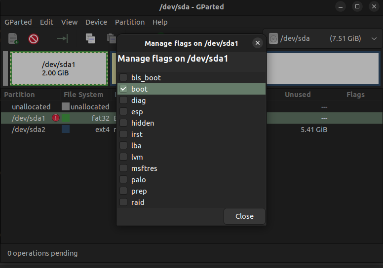

   **Figure 37: Enabling the boot flag for the boot partition**

.. raw:: html

    

**Step 9:** Now your SD card is ready to copy the **boot** and **rootfs** files for the **RB-DCU i.MX 6ULL** board.

.. raw:: html

   

Copying Files(images) to SD Card
================================

**Step 1:** Flashing barebox.bin into SD-card 8 MB raw space.
        
.. code-block:: console

   $ sudo dd if=<path of the barebox image> of=/dev/sd<a/b/c/d> bs=512 skip=2 seek=2
   $ sync

**Step 2:** Copy the kernel image(zImage), oftree image(.dtb) into the boot partition of the sdcard. Below are the command to copy into sd card.
        
.. code-block:: console

    $ cp zImage /media/<username>/BOOT
    $ cp oftree /media/<username>/BOOT  
    
**Step 3:** And root file system tar file should be extract to the rootfs partition of the sdcard using the below commands.
        
.. code-block:: console

   $ sudo tar -xvf <path of the rootfs tar file> -C <path of the sdcard rootfs partition>
   $ sync
   
TARGET :
Now insert the sdcard into the board and make the jumper positions for booting from sdcard.

.. raw:: html

    
   
.. raw:: html

   

=======================
How to Handle the Board
=======================

ESD Safety
------------

**Before touching the board:**

* Work on a clean, non‑static surface (anti‑static mat if available).

* Wear an anti‑static wrist strap grounded to earth.

* Hold the board by its edges—avoid contact with chips or connectors.

* Avoid touching exposed metal parts or pins. 

.. warning::
   Always discharge any static build‑up before touching the board.

**Prepare Your Workspace:**

* Gather all needed items:
* RB-DCU i.MX 6ULL board
* SD card with boot image.
* Power adapter (5V).
* USB‑to‑TTL debugger cable
* Host PC (Linux recommended) with **minicom** or similar terminal software installed.

.. note::
   - Work in a clean, dry, low‑humidity area to minimize static buildup.
   - Keep food and liquids away from electronic components.

**Insert the SD Card:**

* Ensure the SD card is formatted correctly (e.g., FAT32 for boot images).

* Find the card slot on the board and insert.

* Align contacts, then gently push until you hear or feel a click.

* If it resists, pull out, realign, and try again—never force it.

**Connect the Power Adapter:**

* Ensure the SD card is inserted but do not power on the board switch yet.

* Plug the adapter into a grounded wall outlet.

* Attach the barrel connector to the board’s power input jack.

**Connect the USB‑to‑TTL Debugger Cable:**

* Locate the board’s debug port (USB‑to‑TTL header or micro‑USB).

* Insert the TTL end into the board’s debug header pins. Plug the USB end into your host PC.

On Linux, verify with:

.. code-block:: console

   $ lsusb

**Power On the Board:**

* Confirm both the adapter and USB‑to‑TTL cable are connected.

* Turn the board’s power switch to ON.

* LEDs should light up, and the boot process begins.

.. raw:: html

   

======================================
How to Connect the Board with a PC
======================================

Connect to the Board via Serial Console (Minicom)
=================================================

Install Minicom (if it is not already installed):

.. code-block:: console

   $ sudo apt update && sudo apt install minicom

Identify the serial port after connecting the USB-to-TTL cable:

.. code-block:: console

   $ dmesg | grep -i tty

Look for a newly listed device such as `/dev/ttyUSB0` or `/dev/ttyACM0`.

**Start Minicom with the correct port and baud rate (115200):**

**1.** In your host machine terminal:

.. code-block:: console

   $ minicom -s

.. raw:: html

    

**2.** Choose **"Serial port setup"** and configure the following:

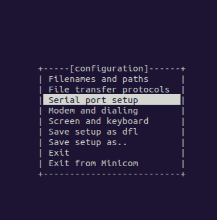

   **Figure 38: Minicom startup screen where the serial configuration menu is accessed**

.. raw:: html

    

**3.** Set the serial device to your USB-to-TTL port (e.g., `/dev/ttyUSB0`).

**4.** Set the baud rate to **115200**.

**5.** Disable **hardware flow control** (set to “No”).

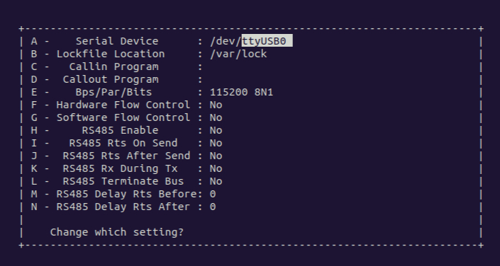

   **Figure 39: Minicom serial settings menu where device, baud rate, and flow control options are configured**

.. raw:: html

    

**6.** Save the setup as the **default configuration**.

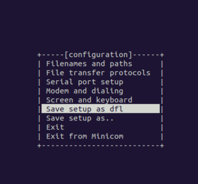

   **Figure 40: Saving the modified serial settings as the default configuration in Minicom**

.. raw:: html

    

**7.** Exit the setup menu to start the Minicom serial console.

**Shutting Down the Board:**

To safely power off the target board, run the following command in the target terminal:

.. code-block:: console

   $ poweroff

.. raw:: html

   

Connect to the Board via SSH (Network Access)
=============================================

You can also connect to the board over the network using SSH. Follow the steps below:

.. note::

   Before using SSH, ensure **both your PC and the embedded board are on the same network**—whether via the same Wi-Fi router, LAN switch, or direct Ethernet connection with static IPs.

   SSH requires proper IP connectivity. If the devices are not on the same subnet or not routable, **SSH will fail**. Always verify connectivity using `ping` or by checking IP addresses.

**Step 1: Check the IP Address of the Host PC**

Use the following command to check your PC’s IP address:

.. code-block:: console

   $ ip a

If no IP is assigned, configure a static IP using:

.. code-block:: console

   $ sudo ip addr add 192.168.2.1/24 dev <network_interface_name>

**Example:**

.. code-block:: console

   $ sudo ip addr add 192.168.2.1/24 dev enp0s31f6

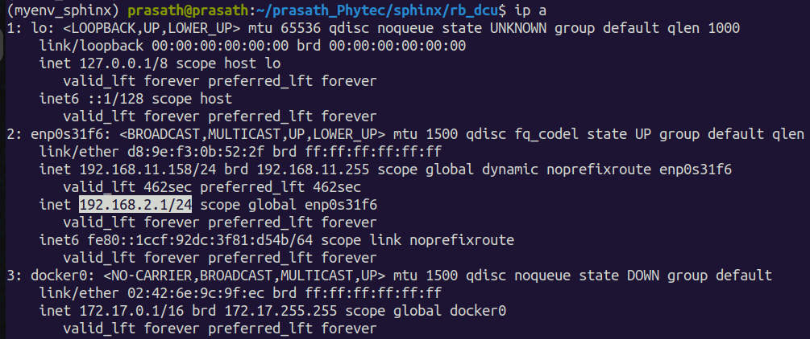

   **Figure 41: Manually assigning a static IP address to the host machine's Ethernet interface**

.. raw:: html

    

**Step 2: Configure the IP Address on the Target Board**

On the target board, verify its IP address:

.. code-block:: console

   $ ip a

If none is assigned, manually configure one:

.. code-block:: console

   $ ifconfig eth0 192.168.11.10 netmask 255.255.255.0 up
   $ route add default gw 192.168.11.1

.. note::

   Make a note of both the assigned IP address and the hostname of the target board for later use.

**Step 3: Install and Enable SSH on the Host PC**

Ensure SSH is installed and running:

.. code-block:: console

   $ sudo apt install ssh
   $ sudo systemctl enable ssh
   $ sudo systemctl start ssh

**Step 4: Connect to the Target Board via SSH**

Once everything is set, connect to the target board using:

.. code-block:: console

   $ sudo ssh <target_board_name>@<target_board_ip>

**Example:**

.. code-block:: console

   $ sudo ssh root@192.168.11.110

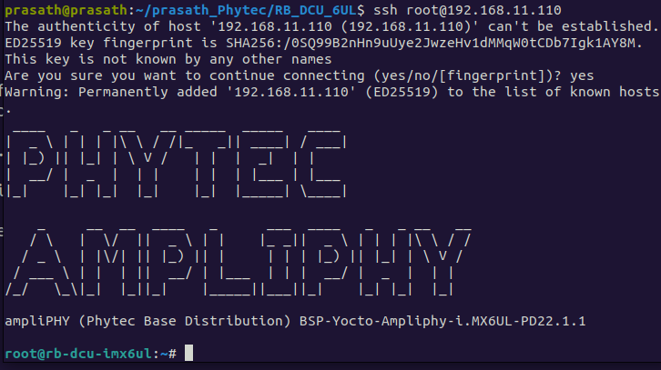

   **Figure 42: Successful SSH session established from the host to the embedded target board**

.. raw:: html

    

.. raw:: html

   

